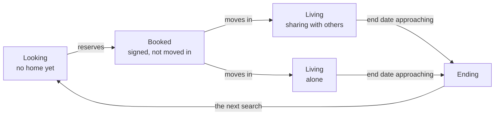

# TAR-09 · The Structure Lock, Open Door

**Read [TAR-08](TAR-08-structure-lock.md) first.** That document locks the structure of the standard app, and this one is its sibling for the open door: the app for anyone who lives on rent, whether or not their landlord has ever heard of us. [TAR-06](TAR-06-open-for-all-feature-map.md) decided what exists in this door. This document decides where it sits and in what order a designer may touch it.

Everything TAR-08 settled about the bar, the index rule and the hub holds here unchanged. One of its three marks is swapped, for the reason given below. This document says what is different, and it is short wherever nothing is.

*Second pass, 9 September 2026. Owner: Sanchay. Written for the same session on the 15th or 16th, read after TAR-08.*

---

## What this is for, and what it is asking you to do

**What I need from you.** Five questions, all of them at the end. One matters more than the other four: **question four, whether this is one product with the standard app or two that share a spine.** It is the one with a number attached and the one that changes a plan rather than a screen. Everything else here is evidence for it.

**The reading map.** Four things, in this order.

1. **This section**, which carries the count and the argument it supports. Five minutes.
2. **The bottom bar**, the one structural decision that differs from TAR-08. Five minutes.
3. **The tree**, six parts, read for where things sit rather than for what they are. Twenty minutes.
4. **The five questions**, where you answer. Ten minutes.

About thirty-five minutes to read and ten to answer, which is shorter than TAR-08 because most of the machinery is already familiar by then.

**The one thing to see.** The record a tenant builds by living in a RentOk property is what this door sells. [TAR-06](TAR-06-open-for-all-feature-map.md) builds the whole open door on it, and TAR-08 says in its own passport section that the passport's shape is decided in TAR-06 and only carried by the standard app. [TAR-00](TAR-00-vision-and-requirements.md), the vision, is more careful than either: it files the tenancy passport among our own additions still to be tested with renters. Until now it has been a sentence rather than a structure. Here it is a structure, and you can see it in Me.

**Where this door actually stands.** Almost nothing in it ships today, so TAR-08's second mark, which asks whether anything exists behind a node, would read *new* on nearly every line and tell you nothing. **This document swaps that mark for the one that matters here: is a node shared with the standard app, or does this door build it alone.** That is the honest size of the open door, and it is the number that decides whether it is a phase or a product.

**Counted, not estimated, and then checked line by line against TAR-08.** Of one hundred and two marked nodes, **thirty-eight are shared with the standard app and sixty-four are built for this door alone.** At section level it is nine shared, nine alone and four mixed, out of twenty-two.

I expected the shared half to be the larger one and wrote that sentence before counting. It is not, and the first count was not clean either. A fact-check against TAR-08 moved eight marks in both directions at once: four things in the search, multi-party signing, giving notice and the society's move-in requirements all turned out to be in the standard app already, while the passport, the self-posting fixed costs and the automatic expense capture turned out not to be. Seven bullets that were carrying two answers were split into their halves, and four nodes that TAR-06 has and this document had lost were put back. **After all of that the shared share moved by half a point and stayed where it was: about thirty-seven nodes in every hundred.** About a third of this door comes free with the standard app and about two thirds does not.

What is shared is real and it is the expensive middle: the money surface, the vault, the condition reports, verification, and almost the whole of the shared tenancy. What is not shared is the entire front of the product, and the record's own shape with it: the search, the Broker, the Lawyer, the landlord line, the maintenance log, the board, the way a stranger first meets us, and the passport, which TAR-08 says is shaped here and only carried there.

That is the honest answer to whether this is a phase of the standard app or a second product. **It is a second product that shares a spine.** [TAR-01](TAR-01-brief.md) puts "the first open-for-all services" into phase four, beside white-label polish. That is a fair description of a few services and not of this. Two thirds of a product does not fit in the tail of someone else's phase, and that belongs in the room on the 15th rather than in a planning meeting six weeks later.

| Shared with the standard app · 38 of 102 nodes | Built by this door alone · 64 of 102 nodes |
|---|---|
| The money surface: dues, paying, receipts, the budget | Find a home, and the AI Broker |
| The vault, and everything that lands in it | The passport, the record a renter carries between homes |
| The condition reports, in and out | The AI Lawyer, and the evidence packet |
| Verification, and police verification | The landlord line, the channel to a landlord who never signed up |
| The shared tenancy: shares, splits, chores, a member leaving | The maintenance log: a dated private record of what broke |
| The agreement signed by every party, and giving notice | The board, where rooms and flatmates are found |
| The hub, minus its property shelf | The free tools a stranger meets us through, and an agreement made from nothing |

*The expensive middle is shared. The whole face of the product is not, and neither is the record's own shape. This is the picture behind question four.*

## How the marks work

Three marks. The first is exactly TAR-08's. The other two are changed, because a door with no property cannot use them as they stand.

**Can a designer start?** **Draw it** means the sequence of steps is settled and a designer can start today. **Solve it first** means the sequence is not settled and drawing now wastes the drawing. Every section gets one or the other, and a section where the flow and the visuals are both broken still gets **Solve it first**. As in TAR-08, a mark sits on the section where the whole section is one or the other, and drops onto individual nodes only where the section is mixed. The same holds for the second mark below. A heading that holds only other sections, a tab or a part, carries no mark of its own, because the sections under it carry them all.

**Who builds it?**

- **shared** means the standard app builds this and the open door inherits it. Same machinery, sometimes richer contents.
- **alone** means this door builds it and nothing in the standard app covers it.
- Where a node exists in both doors but this door decides its shape, it is **alone**, because it does not come free. The passport is the case that matters, and it is the one place the usual direction reverses.

On the page a mark is a middot and a plain word at the end of the thing it marks: · shared, · alone, · mixed. Bold is kept for the first mark, so a reader scanning for Draw it and Solve it first is not fighting anything else.

**Does anything switch it off?** In the standard app the property composes what a tenant sees. Here there is no property, so nothing is switched by anyone else. What varies instead is the renter's own situation, marked · stage where a node appears or disappears with where they are in their renting life, and · household where it appears only when more than one person shares the tenancy. Everything unmarked is always there.

---

## The bottom bar

```
Home   ·   [ Find a home ]   ·   Money   ·   Help   ·   Me
              the one slot that changes
```

**The same five slots. The same four fixed. A slot that changes for a different reason.**

In the standard app the property composes that second slot: it holds what the owner switched on, and it is labelled for the building. Here there is no owner and no switchboard. **The renter's own stage composes it instead**, which is TAR-07's promise that the app knows where you are in the journey, doing structural work rather than sitting in prose.

I walked five lives out of TAR-06 before deciding this, the same way TAR-08's four fixed tabs were derived rather than assumed.

- Meera, twenty-four, first job, moving to Pune and has not found a flat yet.
- Three friends sharing a flat whose landlord has never heard of RentOk.
- A couple in a Gurugram society, agreement uploaded, two employers both wanting rent receipts.
- A family paying cash rent on a handshake, with no agreement at all.
- A student in a PG the app cannot see inside, whose landlord is not a customer.

All five needed Home, Money, Help and Me. The second slot is where they part company, and it parts by **where they are**, not by who their landlord is.

| The renter | The second slot holds |
|---|---|
| Looking for a home | **Find a home**: the search, the Broker, the shortlist, the visits, the application |
| Reserved, not yet moved in | **Moving in**: the application's answer, the agreement waiting on signatures, the society's requirements, and the move-in record ready for the day |
| Living, sharing with others | **My Flat**: the shared tenancy, shares, chores, the split ledger, the people on it |
| Living alone | nothing, and the bar is four |
| Nearing the end of an agreement | **Find a home** again, because the next search is where they are going |

**Moving in is a view, not a new place.** Everything it gathers already lives somewhere permanent: the application in Find a home, the agreement and the move-in record in My tenancy. The stage collects them for the two weeks they matter and then lets them go. Nothing is reachable only from it, which is the rule that makes the whole slot safe. This is [TAR-07](TAR-07-standard-app-feature-map.md)'s **booked** stage, and the first draft of this document skipped it: it went from looking straight to settled and left the gap between reserving and moving in with no stage and therefore no tab, which is where the group application, the agreement and the move-in record all sit.



*The loop the table above lists as rows. Inside a single tenancy the second slot changes three times, Find a home then Moving in then My Flat or nothing at all, and a renter lives through two or three tenancies. Home, Money, Help and Me never move through any of it.*

**The slot is a different tab three times inside one tenancy, and a renter lives through two or three tenancies.** That is the point, and it is why it cannot be a permanent Browse tab: a listing site is a permanent Browse tab, and TAR-06 is explicit that this is not a property app with extras but an app for the renting life itself.

**When a renter lives alone, the bar is four.** Same rule as TAR-08. The slot is not created empty, and it is never filled with something else to avoid the gap. The obvious temptation is to hand it to the landlord line, and that is wrong: reaching a landlord is Help's job, and a slot filled to avoid being empty teaches a renter that the bar means nothing.

**Everything TAR-08 said about safety holds.** Nothing is reachable only from the changing slot; the index inside Me carries everything, always, in the same order. The slot never evicts a fixed tab. And it never changes silently: a renter whose agreement is ending sees one card on Home saying the search is back, once.

### The tabs that do not change, and how each one differs

**Home** is the same four blocks as TAR-08: what is happening now, what changed since you last looked, this life's rhythm, then money sized to what is actually due. The rhythm block is what differs. In the standard app it is dinner and today's mark. Here it is the search when someone is looking, the flat's own week when they are settled, and the end date when it is approaching. Same rule, different filling, and again no exception written. TAR-06 is careful here and this document should be too: it calls the home experience the design team's call, so the four blocks are TAR-08's proposal carried forward rather than a settled thing.

**Money** is the richest tab in this door and the one most shared with the standard app. The difference is that nobody hands the renter their numbers. The agreement is read and the numbers come out of it, or the renter declares them, and everything runs from there.

**Help** means something different here and it is the change I am least likely to be talked out of. In the standard app a human is one tap away, because a property team exists. Here the hardest thing a renter does is reach a landlord who never signed up for anything. So Help is the landlord line, the maintenance log, and a verified lawyer when it goes wrong.

That is also this door's growth engine. Every dated document that reaches a landlord carries our name, and TAR-06 is explicit that the landlord line is how this door feeds the wider vision. Putting it behind a tab rather than inside a settings page is a commercial decision as much as a design one.

**Me** is the heart of this door rather than its filing cabinet. In the standard app the record accumulates quietly while the tenant lives. Here the passport is the product, and Me is where a renter goes to see what they have built and to decide who sees it.

---

# The tree

Six parts, the same shape as TAR-08. Where a part is identical to the standard app, it says so in a line and does not restate it.

**Every code here starts with O, for the open door.** TAR-08 uses the same numbers for different things, so O-B5.5 is this document's My tenancy and B5.5 with no prefix is TAR-08's passport. With both documents on the table, the prefix is what stops "go back to B5.5" meaning two things at once.

---

## Part A · Before the tabs

**Solve it first, all of it.** This is the part with no equivalent in the standard app, because in that door an owner hands the tenant the app at move-in and here nobody hands anybody anything.

### O-A1 · The tools that are the way in, the free ones anyone can run

**Solve it first.** · alone.

TAR-06's rule, and it decides the shape of this whole part: **the tool ends where the workflow begins.** Each of these works completely on its own, for a person with that problem today, with no account and no strings. Then, at the moment its value has just landed and only then, the app offers the next step. Once. Never a popup at the door.

- A rent receipt, made properly and ready to file · alone
- An agreement checked against the law of the renter's own state · alone
- What rent really costs in the lane they are considering · alone
- What a city really costs to live in, for someone weighing a move · alone
- What a move will actually cost, all of it counted · alone
- A trip planned, and a week of meals planned · alone

**Login gates the result, never the discovery.** The tools are findable and startable by anyone. The finished thing is where the account begins. Nothing useful escapes without a login and nobody meets a wall before they have seen the value.

**These are entrances, not features.** They sit in Part A rather than inside a tab because most renters will meet this app through one of them rather than through a property search.

Each one lands somewhere once the account begins: a receipt lands in Money, a checked agreement lands in the vault with its notice reminder set, the cost and rent answers land in Find a home, the trip and meal planners land in the hub. That landing is the workflow the tool was the way into, and it is the same node, not a second copy.

### O-A2 · The entrance

**Solve it first.** · mixed.

- Phone number and the one-time code · shared
- Who you are: the light step that shapes the tools, the offers and the passport from the first screen · shared
- Arriving from a shared passport, a receipt someone forwarded, or a landlord's own message · alone
- Arriving from a RentOk property, with a passport already written · alone. TAR-06 calls this the single best reason for someone who has left our properties to come back to us, and it is the one arrival that is already full rather than empty.

---

## Part B · The five tabs

### Tab 1 · Home

**Solve it first.** · shared. The four blocks and the sizing rule are TAR-08's, unchanged. What differs is what fills block three, and it follows the same stage that composes the second tab: the search's own state when looking, the flat's week when settled, the end date and the next home when ending.

- The renter's own to-do list, which is theirs and which the app never writes to · shared. TAR-08 has it too, inside the property's tab. It moves to Home here because a renter living alone has no My Flat tab and would otherwise lose it entirely, and TAR-06 counts it among the reasons the app is opened on an ordinary day. Shared lists stay in My Flat, where the household is.

### Tab 2 · Money

The three questions are TAR-08's: what stands right now, what happened, what is coming. The tab is those three. What changes is where the numbers come from.

#### O-B2.1 · Setting it up, once

**Solve it first.** · alone. Nobody hands this renter an invoice, so the app has to learn the tenancy before it can run one.

- The agreement read, and everything in it offered back as a ready setup: landlord details, rent, due date, notice period, lock-in, escalation steps, end date, and who is responsible for what · alone
- Terms without paper, declared by the renter: rent, due date, deposit paid, notice period, and everything running off the declarations · alone. TAR-06 calls the paperless renter the majority, and serving them as a first-class citizen rather than a fallback is one of the most useful things this app will do.
- Every person the agreement names read out of it and invited to claim their own entry: co-tenants, dependents, a guarantor, the landlords, each verifying themselves rather than being asserted by a flatmate · alone
- The landlord's own details verified from what the renter provides, without the landlord being involved at all · alone
- One tap to turn a handshake into a real agreement, whenever they are ready and never before · alone

#### O-B2.2 · What stands right now

**Draw it.** · shared, and richer here.

- What is due, and when · shared
- Real months: pro-ration from the seventeenth, part payments, late payments, and late fees where the agreement names them · shared. A ledger that only understands full on-time payments is dishonest by omission.
- The deposit as a living balance, with its rules from the agreement · shared
- What each person owes in a shared home · shared · household

#### O-B2.3 · Paying, and being reminded

**Draw it.** · shared.

- The reminder before every due date, every month, without being asked, because in the standard app the property raises the invoice and here nobody does · alone
- Paying through the app, or through the renter's own app with the app recording it, or on autopay · shared. Nobody is forced through our rails to get the benefit of the record.
- Bills by consumer number, whoever's name is on them, recorded as the renter's own expense · shared

#### O-B2.4 · What happened

**Draw it.** · shared.

- The receipt, automatic, every month, ready for the office · shared
- A proper invoice with tax details where the landlord has GST, because that is what an employer needs for reimbursement · shared
- Per person in a shared home, because three people paying ten thousand each need three receipts and not one for thirty · shared · household
- The running statement, and a whole year in one view · shared

#### O-B2.5 · What is coming, and the budget

**Solve it first.** · shared, and this door leans on it harder.

- Next month's likely cost, and the warning before it gets uncomfortable · shared
- A full expense and budget manager, not a rent-only ledger: budgets built from the real repeating charges, and expenses entered by hand · shared
- Expenses captured on their own, through channels the renter consents to · alone. TAR-08 has cash spending entered by hand and nothing automatic.
- Splits and settlements feeding it, rent and bills flowing in on their own · shared · household

---

### Tab 3 · The changing slot

Two occupants, decided by stage. Neither is switched by anyone but the renter's own situation.

#### O-B3.1 · Find a home · stage

**Solve it first, all of it.** · mixed. What the standard app refuses is browsing any property other than the tenant's own. The property page, the visit, the token and the group application all sit in TAR-08's own before-the-tenancy section, so four things here are shared and everything that makes this a search is not.

- The classic way: search, filter, compare, shortlist · alone
- **The AI Broker**: a conversation that does everything the classic way does and more · alone
- What makes it a broker rather than a search box: it recommends what fits, says what is true, and flags what does not fit even about the properties it is showing · alone
- It hands off into viewing, visiting and reserving from inside the chat, so the conversation is not a detour from the search · alone
- What it knows, and this is the part no listing site can answer: the real rent in that lane, what renters report about water, power, commute and safety, and who a building suits in general terms so it can answer "will I fit here" · alone
- Every preference and dealbreaker spoken in the conversation captured into the app's memory of that person, so the next search starts already knowing them · alone
- The property page: rooms, sharing options, rent and terms, photos and video, location and the commute, the same page TAR-08 shows for the one property a tenant is joining · shared
- What a door with many properties has to add: reviews stamped when they come from a stay the system itself witnessed, verified landlord and property badges, scam protection · alone
- Booking a visit, rescheduling it, cancelling it without penalty games · shared
- What this door adds to the visit: a tour, a video call or a phone call, visit notes, and two places compared side by side · alone
- Reserving: a token holds the room, the receipt is immediate, and the terms are in plain words before anyone pays · shared
- Token protection on verified listings, and the app saying plainly where no such protection applies · alone
- Searching together: one shortlist, joint visits, a combined budget, the Broker advising the whole group · alone · household
- The group application, where every member's passport goes together so a landlord evaluates the actual household rather than one known person and two strangers · shared · household. TAR-08 carries the same one-home-several-people application; what this door adds is the passports inside it.
- Verified brokers, clearly marked, for the renter who wants a human · alone
- The application itself, which is the passport attaching automatically · alone

#### O-B3.2 · My Flat · household

**Solve it first, all of it.** · shared with the standard app's people-on-your-agreement, and it is the largest single piece of shared machinery in this document.

- Co-tenants and dependents, each with their own login, their own passport, linked but never merged · shared
- Shares that are not assumptions: the bigger room pays more, every recurring cost carries its own participant list, and the flatmate who never eats the tiffin is not in the tiffin split · shared
- Fixed costs posting themselves with their own payee, variable ones reminding and then splitting · alone. TAR-08 splits by hand and by name, and its not-building list bans money custody in splitting, so the posting is this door's own.
- The ledger settling everyone to whoever fronted the rent · shared
- Chores and shared lists, so the gas cylinder actually gets bought · shared. TAR-08 flags chores as the one thing on that list needing its own call on whether it waits for the research round.
- One member leaving, the most common shared-tenancy event and handled on trust today: the vacancy posted pre-filled to the board, candidates applying with their passports, and only the remaining flatmates' agreement finalising it · shared
- What the swap then fires: the agreement re-signed with the new party list, verification starting for the newcomer, and the newcomer recording the room's condition as they take it over · shared
- The money of leaving: the departing member's deposit share settling person to person, and shared assets settling the same way, the fridge bought together staying with whoever keeps it and the buyout on the record, or going to the board's marketplace · shared
- Everyone leaving, with the deposit returning by recorded shares · shared
- Flatmates rating flatmates, shown when someone is weighing a potential flatmate · alone

**Deliberately absent:** who talks to the landlord. TAR-06 rules it out by name. Flatmates arrange their own spokesperson, everyone is a party to the agreement anyway, and an app feature here would be ceremony.

---

### Tab 4 · Help

One job, the same as TAR-08: **reach someone.** The someone is different, and that changes everything inside the tab.

#### O-B4.1 · The landlord line

**Solve it first.** · alone. TAR-06 gives this its own named section because it is bigger than any one feature, and this is where it lives.

- The landlord saved once, and then the renter choosing what reaches them automatically · alone
- The move-in report to acknowledge, the logged repair to reimburse, the running ledger against next month's rent, the move-out report to sign: structured, dated, professional documents arriving from their own tenant · alone
- Renewal, which TAR-06 calls the easiest sale in the product: the same draft carried forward, the escalation already calculated, both sides reading the same document · alone
- What rents actually did in that lane this year, sent to the renter at renewal time, so an increase is negotiated from shared facts · alone
- The three messages that go the other way, each about the landlord's own property and their own tenant: renew it here, the police verification that expires every year, and rate your tenant now the stay has ended · alone. The last one is what fills the passport's landlord-said layer, and nothing else produces it.
- Rating the landlord, whether or not they have ever touched RentOk · alone
- Reading what other renters said about a landlord, which is the half of rating that protects the next renter · alone
- Refer your landlord, which is the one referral this door pays real money for, paid when the landlord becomes a paying customer rather than on a signup · alone

**The two rules that govern this channel, and they are not negotiable.** Each side hears what serves them, never a cold pitch. And nothing about the renter's private life in the app is ever reported: an expiring agreement is a shared fact, a search for the next home is not.

#### O-B4.2 · The maintenance log

**Solve it first.** · alone.

- A private, dated record of everything that breaks and every time the landlord was told, with photos before and after and bills attached · alone
- The app doing the noticing: a plumber's bill uploaded, read, recorded as an expense, recognised as maintenance, and the log entry drafted · alone
- Because the agreement reader already knows who is responsible for what, the suggestion completing itself: this looks like the landlord's to bear, add it against next month's rent? One tap, or ignore it, and ignoring is free. · alone

#### O-B4.3 · When it goes wrong

**Solve it first.** · alone.

- The AI Lawyer: any agreement reviewed against the tenancy law that actually applies in that state, and co-living or hostel membership terms reviewed too, because for those renters the terms they clicked are the agreement · alone
- What the review returns: one-sided clauses flagged in either direction, landlord-sided or tenant-sided, and every clause explained in plain words · alone
- The rule it never breaks: it always says which state's law it is applying, and says plainly when it does not know · alone
- A verified human lawyer, booked at any point · alone
- The evidence packet when the deposit conversation fails: dated reports, payments, the log of what was reported and when, assembled in one piece and ready to hand over · alone

#### O-B4.4 · The people around this app

**Solve it first.** · alone. The community's plumbing, and it belongs in Help because it is what a person reaches for when another person is the problem.

- In-app messaging, so nobody hands a stranger their phone number to ask a question · alone
- Report and block, with real consequences, verified or not · alone. A woman ending a conversation with an unknown flatmate must know it stays ended.

#### O-B4.5 · The board

**Solve it first.** · alone. **One object, two doors into it**, the same pattern as the hub in TAR-08. It is entered from Find a home when a renter needs a flatmate or a room, and from My Flat when a member is leaving. It is not duplicated in either place.

- Rooms available and rooms wanted, the way the locality groups work today but with real identity · alone
- Verified members carrying a visible tag, unverified members able to browse and post, and the difference plain · alone
- Passports shared between members, which turns the terrifying stranger-roommate decision into an informed one · alone
- Compatibility on the things that actually decide it: schedules, food, guests, cleanliness · alone
- The peer marketplace: the mattress, the fridge, the desk, sold to the next renter in the same locality instead of abandoned · alone

---

### Tab 5 · Me

#### O-B5.1 · The passport

**Solve it first, all of it.** · alone. TAR-08 carries a passport and says in the same line that its shape is decided in TAR-06 and only carried there. So none of it comes free: the standard app inherits this from the open door rather than the other way round, and it is the one place in this document where the usual direction reverses.

- Four layers, each labelled so a reader knows what is verified and what is claimed: self-declared, witnessed, verified, showcase · alone
- Shaped to the renter: a student's leads with education and guardian, a family's carries dependents, a professional's carries employment. No two look alike, by design · alone.
- Each verification stamped with when it was done, so a landlord knows what is current and what has aged out · alone
- Reputation in two voices kept apart: what landlords said, shown as one party's view, and what was witnessed, which is factual and machine-kept · alone
- **The score, and its one rule**: it reads how someone rented, never how often they moved. A student who changed PGs every semester and paid on time every month is a reliable tenant with normal mobility. Punishing movement would punish exactly the renters this app exists for · alone.
- The passport travelling: attached to every application, shared with a broker, downloaded as a document for any landlord anywhere · alone
- Arriving already written for anyone who rented through a RentOk property · alone

#### O-B5.2 · The memory, beside the passport

**Draw it.** · alone. The passport proves; the memory, which is this app's private picture of one renter, knows. Tastes, habits, dealbreakers, gathered from Broker conversations and from what the renter writes. Private first: it powers matching and recommendation and none of it reaches a landlord unless the renter puts it there. The showcase bio is the renter choosing what the memory shows to peers, and it never leaks to the person deciding their application.

#### O-B5.3 · The vault

**Draw it.** · shared. The agreement, receipts, the condition reports and their video, identity documents, landlord details, payment history. Everything the app produces lands here on its own, and everything the vault knows about dates becomes a reminder. Nothing expires silently.

#### O-B5.4 · Verification

**Solve it first.** · shared.

- Identity and background check, done once, paid once, reusable everywhere · shared
- **Police verification as its own service**, not folded into a background check, because a landlord asks for it almost as often as for the agreement itself. Digital where the state offers it, arranged physically where it does not, and the app knowing which applies. Self-initiated, for the renter and for every family member when a family rents together · shared.
- Every completed agreement ending with the same recommendation: get the police verification done now, while the details are fresh · alone

#### O-B5.5 · My tenancy

**Solve it first, all of it.** · mixed. Creating the agreement is this door's; most of running the tenancy afterwards is the standard app's, and the node marks say which is which.

- Creating the agreement, or completing the landlord's draft: identity, drafting, stamping, signing, one workflow, for a service fee plus the government's own charges · alone
- Signed by everyone it binds: any number of tenants, any number of landlords, a guarantor where one is asked for, every status visible, complete only when every party has signed · shared. TAR-08 carries multi-party signing in three places, including its own flow table. Only the choice of signing method below is this door's, and that comes from TAR-06.
- Every signer choosing their method, an included one and a paid one · alone
- The move-in record: the walkthrough, the extraction, the renter confirming, the report standing as dated proof even if the landlord never participates · shared
- The move-out record, its mirror · shared
- Notice: the vault already knows the period and the end date, the app reminds, and the letter is drafted ready to send · shared. Giving notice ships in the standard app today; the reminder and the letter are what this door adds to it.
- The deposit request as a step rather than a chase: verified bank details already saved, one tap sending a proper message with the settled reports behind it, gentle reminders until it lands · alone
- The society's own requirements, sitting in the move-in flow rather than discovered from a security guard on moving day · shared. TAR-08 carries the society's rules and its move-in permissions in the house facts card, inside the property's tab; with no property tab here, they move into the move-in flow.

#### O-B5.6 · My account

**Draw it.** · shared. Settings and which channels reach me. Privacy, and what each audience sees: public, peers, landlords. **The index**: everything this app does, always in the same place and the same order, which is what makes the changing slot safe. Exporting everything and deleting the account, with one-sided data leaving and bilateral artifacts surviving for the other party, exactly as TAR-08 has it.

---

## Part C · The hub

**Solve it first**, except Offers, which is **Draw it** once the scoping exists. · mixed. TAR-08 marks its city shelf and its RentOk shelf Solve it first as well, so nothing here is ready to draw merely because it appears in the standard app.

**Three shelves, not four.** TAR-08's hub is one object across all three doors, and the only shelf that depends on a property existing is the first one. Here that shelf is absent and the rest is identical.

- **From your city**: cleaning, repairs, maid, cook, tiffin, laundry, doctor visits, couriers · shared. Chosen, not scraped, because a directory of everyone is a directory of no one.
- **From RentOk, because you rent**: tax and accounting help for housing-rent claims, insurance, movers and packers, storage between homes, couriers for what gets sent ahead, a doctor on call, and legal help from verified lawyers · shared. The same shelf TAR-08 builds, and this door adds nothing to it.
- **Offers**: tenant and medical insurance, and brand deals that earn their place · shared. Kept apart from services on purpose, because a service is something you book and someone shows up. Where offers belong is TAR-08's own open question seven, and this document does not close it.
- **The small companions**: the trip planner, the meal planner, the cost-of-living guide · alone. They are entrances in Part A and they live here afterwards, which is the tool-becomes-workflow rule made structural.

**Money help at move-in belongs here and not in Money**: zero-deposit and pay-in-parts offers matched to the renter's record, and a true-cost calculator so nobody is surprised by deposit plus advance plus brokerage plus movers · alone. TAR-08 keeps zero-deposit out of door one entirely, so this shelf is the only place it appears. It is a partner product, so it sits with the partners.

---

## Part D · The flows that take over the screen

Every one is **Solve it first**, for TAR-08's reason: a flow whose steps are unsettled cannot be drawn at all.

| The flow | Where it starts | Who builds it |
|---|---|---|
| A tool run by a stranger, resolving into an account | Part A, any entrance | alone |
| Creating or completing an agreement, through to signing | My tenancy | alone |
| The move-in record, and the move-out record | My tenancy, and the reminder as the end nears | shared |
| Verification, and police verification | Me, and after every signed agreement | shared |
| Paying, and setting up autopay | Money | shared |
| The group application | Find a home | shared |
| A member joining or leaving a shared tenancy | My Flat, or the board | shared |
| The deposit request, and the evidence packet when it fails | My tenancy, then Help | alone |
| Onboarding a landlord who was sent a document | The landlord line, from their side | alone |

**TAR-08's two rules from the design language hold here unchanged**: every multi-step flow saves its progress and reopens where the renter left off, and every system permission is preceded by a plain-words screen of ours and survives refusal gracefully.

**One rule this door adds.** The app does the noticing, the renter does the deciding. Pattern recognition drafts the expense, the split, the log entry, the deposit request; the human taps yes, edits, or ignores, and ignoring is always free. Nothing nags twice, nothing demands completion, and the only pending tasks in this product are the ones the renter wrote themselves.

---

## Part E · The index

Identical to TAR-08, and it does the same job for the same reason. Everything this app does appears in one index inside Me, in the same place and the same order for every renter, complete, never shrinking when the bar shrinks. It is what makes a changing slot honest rather than a hiding place. The one difference: there is nothing switched off by a property here, so the index never has to explain an absence, only a stage.

---

## Part F · What is deliberately not in this tree

Nothing is silently dropped.

### The standard app's own surfaces

The mirror of TAR-08's table. These exist in doors one and two and deliberately not here.

| Not in this door | Why |
|---|---|
| The property's tab, and everything in it | There is no property. Food, presence, the gate, the notice board and house facts all need an owner who runs them. The one thing that crosses over is a housing society's own rules and move-in permissions, which move into the move-in flow, because they are the renter's problem whether or not anyone runs an app. |
| The welcome, joining and day one | No owner hands anyone this app. Part A replaces it, and its shape is completely different. |
| Complaints to a property team | There is no team. The maintenance log and the landlord line do this work, and they are evidence rather than a ticket. |
| The Family Window and the parent app | TAR-06 rules it out by name: it belongs to the doors where a property relationship exists. This door is the renter's own. |
| The membership fee | This door earns on transactions, the offers economy, and in time the record. Charging a renter a monthly fee for an app their landlord does not use is a different business and not this one. |
| The property's voice, and the switchboard | Nobody composes this app but the renter. |

### Deferred in TAR-06, and therefore not given a node

Polls and the event planner, both of which have to prove themselves in doors one and two first. The internships and jobs board. Company-leased homes. Reporting rent history to credit bureaus, which waits for the witnessed record to reach real volume. Rent inside every bank's bill-pay app. Electricity overcharge detection. Room handover matching. Each has a revival condition recorded in TAR-06.

### Named in TAR-06's not-building list

Utility connection transfers. A safety and SOS layer, because a half-built safety feature is a liability. Broker fee blacklists. Subletting workflows, because the AI Lawyer answers the legality question and a workflow would help people breach their own agreements.

---

## The five questions

TAR-08 has eight. This document adds five, and they are the ones that only exist because there is no property.

**1. Does the stage compose the second slot, or is Browse a permanent tab?** I made it stage-composed, so it is Find a home while looking, Moving in once a home is reserved, My Flat while sharing, and absent for the renter living alone. The cost is that the bar changes shape three times inside one tenancy, which no other app does. A permanent Browse tab is steadier and it is also what every listing site already is, which TAR-06 says this app is not. Stage, or Browse?

**2. When a renter lives alone, the bar is four. Is that right?** The obvious fill is the landlord line, and I refused it: reaching a landlord is Help's job. But a solo renter is a large share of this door, and I have given them the smallest app. Four, or does something earn that slot?

**3. Does the landlord line deserve a place on the bar?** I put it inside Help, which makes Help mean the landlord rather than the property. It is this door's growth engine, every document it sends carries our name, and there is a case for it being the second tab for a settled renter instead of My Flat. Inside Help, or on the bar?

**4. Is this one product with the standard app, or two?** The count says roughly two thirds of it is built alone, and that number barely moved when every mark in it was checked against TAR-08 line by line. The bar, the money surface, the vault and the hub say one. My answer is that it is one system and two products, and the practical consequence is that it needs its own build plan rather than the tail of someone else's phase. Do you agree, and does that change what we tell the stakeholder group?

**5. The tools as entrances.** A receipt, an agreement check, a cost-of-living answer: each works completely for a stranger with no account, and the account begins at the finished result. I put them in Part A as entrances rather than as features inside tabs, because how a stranger meets us is structural. The cost is that Part A is now the largest unsolved area in the document. Entrances, or nodes inside their tabs?

---

## Before the 15th

Read TAR-08 first and this one second. The ask is at the top of this document, the five questions are directly above, and a decision on question four is the one thing I would not leave the room without.

## Changelog

- 9 September 2026, second pass: every shared-or-alone mark checked against TAR-08 line by line. Eight marks moved, in both directions. Seven bullets carrying two answers were split. Four nodes TAR-06 has and this document had lost were restored: the co-tenant invites the agreement reader produces, the renter's own to-do list, the three messages the landlord line sends the other way, and the reading side of landlord ratings. The counts were recomputed from the file: 38 of 102 nodes shared, 9 of 22 sections shared, 9 alone and 4 mixed. The first count had also included the three lines that define the marks, so the earlier 33 of 90 was really 32 of 87; the shared share moved by half a point across the whole correction. TAR-07's **booked** stage was added to the bar's loop, which the first draft skipped. Three misattributions were corrected: the passport strategy is TAR-06's and TAR-08's rather than TAR-00's, the swapped mark is TAR-08's second and not its third, and TAR-01's phase four names the first open-for-all services rather than this door.
- 9 September 2026: first version. Written after TAR-08 and sharing its bar, its marks, its index rule and its hub. The archetype walk was run again on five lives out of TAR-06 rather than carried over from door one. The second mark was swapped from "is anything behind it" to "who builds it", because in a door where nothing ships yet the first mark says nothing and the second says everything. The shared-versus-alone count corrected a claim made before counting: the shared portion is roughly a third, not slightly more than half.
